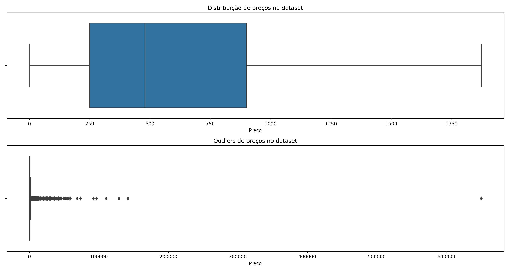
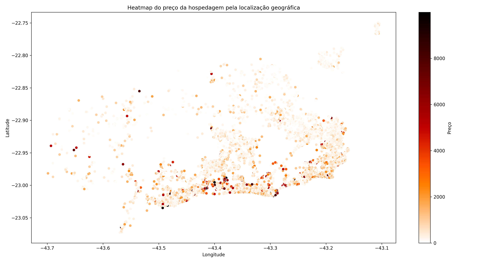
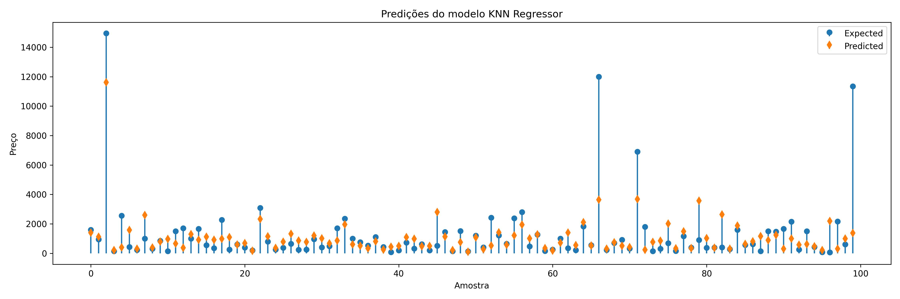

# Previsão do preço da estadia em Airbnbs no Rio de Janeiro

O Airbnb interrompeu com sucesso o setor de hospitalidade tradicional à medida que mais e mais viajantes decidem usar o Airbnb como seu principal provedor de acomodação. Desde a sua criação em 2008, o Airbnb teve um enorme crescimento, com o número de aluguéis listados em seu site crescendo exponencialmente a cada ano.

No Brasil, um destino turístico quente é a cidade do Rio de Janeiro. Isso implica que o Rio de Janeiro é um dos mercados mais quentes para o Airbnb no Brasil, com mais de 24.548 anúncios em dezembro de 2021. 

## Dataset

O dataset foi disponbibilizado pelo Airbnb com dados até 24/12/2021 e pode ser baixado [aqui](http://insideairbnb.com/get-the-data.html). Os dados contam com 74 colunas, porém a maioria dessas colunas contém dados não relevantes para a tarefa em mãos, sendo asssim apenas as seguintes columnas foram selecionadas:

- id
- description
- latitude
- longitude
- property_type
- room_type
- accommodates
- bedrooms
- beds
- amenities
- minimum_nights
- instant_bookable
- number_of_reviews
- price

Uma análise inicial dos dados mostrou a falta de valores nas colunas `description`, `bedrooms` e `beds`, sendo assim as seguintes estratégias foram adotadas para o tratamento desses casos:

- A coluna `description` foi preenchida com strings vazias;
- As linhas sem informações da quatidade de quartos foram removidas;
- Os registros sem informações da quantidade de camas, foram preenchidos com os mesmos valores da quantidade de quartos, assumindo uma cama por quarto.

Com o objetivo de prever dados da coluna `price`, faz-se necessário uma exploração dos dados disponíveis. A figura a seguir mostra a distribuição de preços para os imóveis presentes no dataset, pode-se perceber a concentração em valores abaixo de 1000 contudo como mostrado no segundo plot o conjunto de dados possue muitos outlizers indicando uma grande variância nos preços das estadias na cidade do Rio de Janeiro.

Além disso dado a alta requisição por estadias próximas a pontos turísticos vale a pena ser analisado os preços por região geográfica defina pela latitude e longitude da hospedagem. A figura a seguir mostra o heatmap do preço da hospedaem pela sua localização.

## Feature engineering

As seguintes novas features foram criadas:

- A localização é sempre um fator importante nos serviços de hospedagem. Para torná-lo mais descritivo, foi calculada uma nova feature com a distância do alojamento ao centro da cidade;
- As comodidades oferecidas por um anfitrião podem afetar o preço da hospedagem e, para enriquecer as predições, pode-se determinar quais das comodidades mais especiais e/ou raras podem tornar uma propriedade mais cara. Sendo assim foi adicionado colunas no formato _one hot encoding_ para descrever a presença de certas comodidades;

## Modelo

Um dos desafios na construção de modelos é misturar características que possuem escalas diferentes. Quando mistura-se unidades com diferentes ordens de grandeza, nossos modelos podem não encontrar os coeficientes adequados. Para contornar esse problema, as features do modelo foram normalizadas para ter média zero e variância unitária.

Os medlos escolhidos para treinamento foram `RandomForestRegressor`, `KNeighborsRegressor` e `XGBRegressor`. A tabela a seguir mostra a performance dos modelos treinados para algumas métricas de regressão.

|     Model     |  R2 Score |     RMSE    |     MAE    |
|:-------------:|:---------:|:-----------:|:----------:|
| Random Forest | -0.055514 | 3970.023906 | 879.603356 |
|      KNN      |  0.038439 | 3789.216544 | 816.915568 |
|      XGB      | -0.051621 | 3962.695788 | 876.995758 |

Dado as métricas apresentadas o modelo `KNeighborsRegressor` apresentou a melhor performance na tarefa de predizer os preços das acomodações. A figura a seguir mostra algumas predições realizadas pelo modelo bem como os valores esperados.

